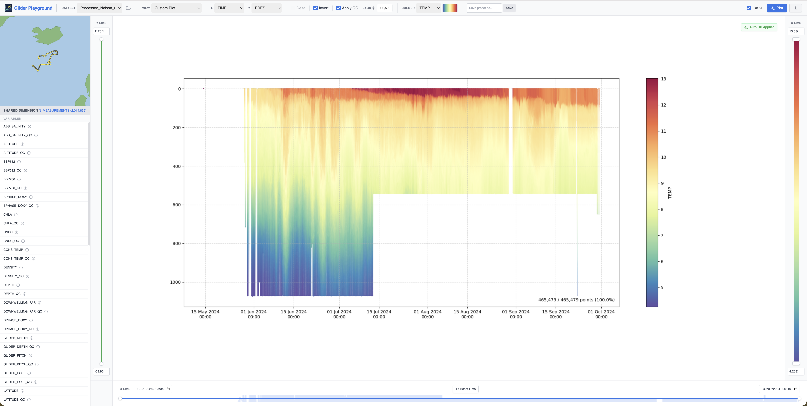

# Glider Playground

A fast, web-based NetCDF explorer for viewing and validating glider data. This tool provides a highly responsive UI to explore oceanographic `.nc` files without running computationally heavy processing steps on the fly. It was built as a simple tool to learn about glider data at NOC (National Oceanography Centre).

**Live Demo:** You can try out the site with demo data right now at [glider-playground.co.uk](https://glider-playground.co.uk). *(Please note: this is running on my personal Raspberry Pi, so it might be a little slow!)*



## Installation

To explore your own data locally with full performance, you can download the tool via pip. Ensure you have Python 3.9+ installed. It is recommended to install this inside a virtual environment to keep your system clean.

```bash
pip install glider-playground
```

## How to Run

Once installed, you can start the application from anywhere in your terminal by simply typing:

```bash
glider-playground
``` 

This will start the local server and automatically open the application in your default web browser. To stop the server, return to the terminal and press `Ctrl+C`.

## How to Use

### Loading Data
`.nc` data files must be placed inside a local `data` folder (this folder is created automatically in your current directory the first time you run the app). You can click the **Folder** icon in the top navigation bar to open this directory. Once files are added, select your dataset from the dropdown.

*Need sample data?* OG NetCDF files can be downloaded from the [BIO-Carbon Deployment Catalogue](https://platforms.bodc.ac.uk/deployment-catalogue/BIO-Carbon/). Thanks to NOC for making these resources available.

### Views & Plotting
* **Basic Plotting:** Select your X and Y variables. You can optionally select a third variable to map to the **Colour** axis and choose a specific colourmap. 
* **Presets:** Use the **View** dropdown to select built-in, pre-configured oceanographic views (e.g., Thermal Structure, Salinity Profile). You can also save your own axes and colour combinations as **Custom Views**.

### Interaction & Analysis
* **Smart Zoom:** Click and drag a box directly on the plot to zoom. When you zoom on X or Y, the **Colour axis auto-scales** its contrast to focus on the data currently in view.
* **Manual Trimming:** Use the interactive range sliders on the X, Y, and Colour axes to precisely trim data limits.
* **Data Inspector:** Click any point on the plot to trigger the Inspector. This reveals exact values in the sidebar and updates the mini-map to show the glider's GPS location at that moment.
* **Reset:** Click **Reset Lims** to return to the full dataset overview and original colour scaling.

### Quality Control (QC) Filtering
If your dataset contains standard `_QC` variables, the tool cleans the data automatically. 
* You can adjust which data points are visible by providing a list of flags (default is `1,2,5,8` for good/interpolated data).

### Exporting
* **Plot All:** By default, the tool downsamples to ~250,000 points to keep the UI snappy. Tick **Plot All** to render every single point at high resolution.
* **Download:** Click the **Download** icon to save your current view as a PNG.

## Uninstalling

```bash
pip uninstall glider-playground
```
