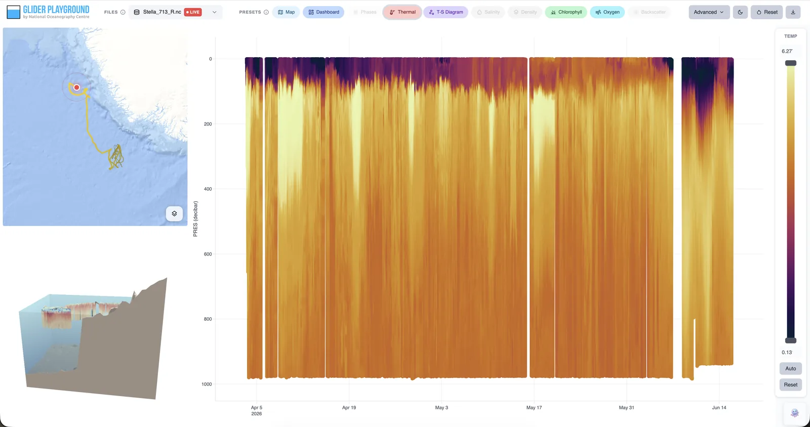
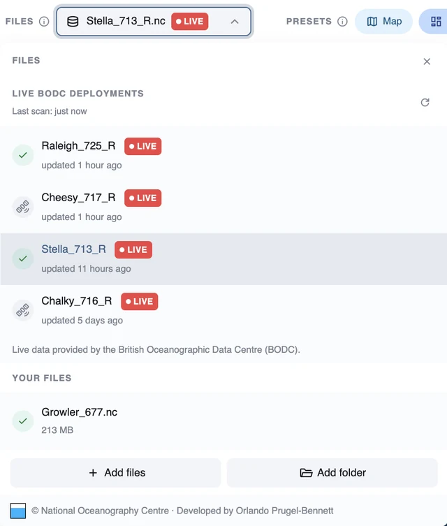
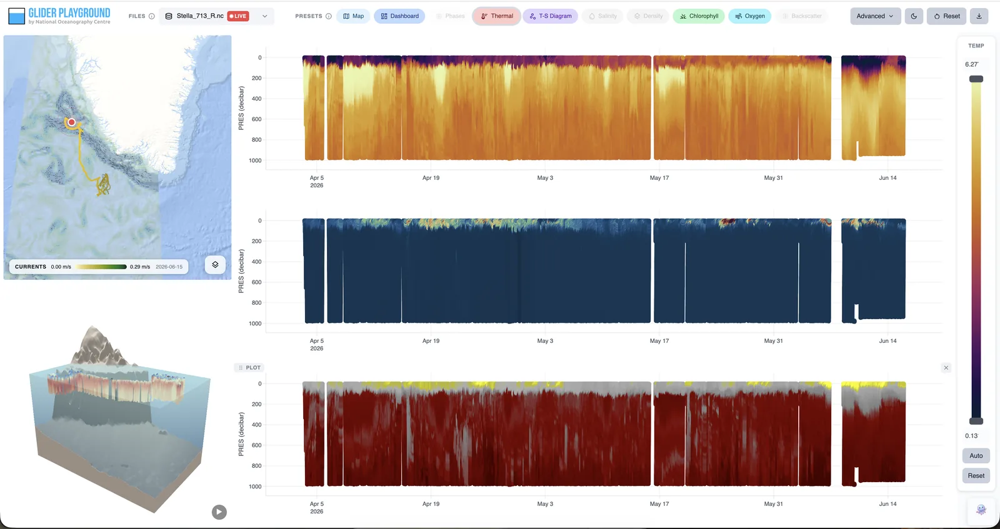
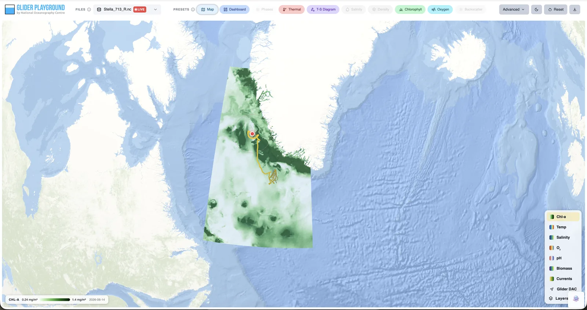

# Glider Playground

<a href="https://www.noc.ac.uk/" title="National Oceanography Centre"></a>

A fast, web-based explorer for ocean glider data. Load OG1 NetCDF files — or pull live deployments straight from BODC — and instantly plot, inspect, QC, and view them in 3D, all in your browser with no scripting required.

**Live demo:** [glider-playground.co.uk](https://glider-playground.co.uk) *(running on a Raspberry Pi — may be slow)*



---

## Install & Run

```bash
pip install glider-playground
glider-playground
```

This opens the app in your browser. Press `Ctrl+C` in the terminal to stop it.

> **Virtual environment recommended.** If you use one, activate it before running.

<details>
<summary>Install from source</summary>

```bash
git clone https://github.com/Orlando-PB/glider-playground.git
cd glider-playground
pip install .
```
</details>

---

## Loading Data



Click the **file button** (top-left) to open the file panel. You can:

- **Browse live BODC deployments** — pull published datasets directly from the British Oceanographic Data Centre
- **Add files** — pick individual `.nc` files
- **Add folder** — load an entire folder of `.nc` files at once

Your own files are processed once in the background. Once ready, click a file to load it.

> **File format:** input files must be in [OG1](https://github.com/OceanGlidersCommunity/OG-format-user-manual) format (or OG1-compatible) — the OceanGliders community NetCDF standard.

> Live data is provided by the [British Oceanographic Data Centre (BODC)](https://platforms.bodc.ac.uk/deployment-catalogue/).

---

## Views & Layout

Glider Playground is a flexible, multi-panel workspace — plots, the globe, and the 3D track are all panels you can arrange however you like.

- **Drag** a panel by its header to reorder or swap it with another
- **Split** any panel (the edge **+** buttons) to add another plot beside it
- **Resize** by dragging the dividers; **close** a panel with its ✕
- On a **vertical / mobile screen** the built-in presets automatically re-flow so plots sit on top and the maps share a row beneath

### Presets

One click rebuilds the whole workspace:

| Preset | What you get |
|---|---|
| **Map** | Globe + 3D view side by side, no plot |
| **Dashboard** | Globe + 3D alongside a stack of thermal / chlorophyll / oxygen plots |
| **Thermal, Salinity, Density, Chlorophyll, Oxygen, Backscatter, T-S Diagram, Phases** | A single plot of that variable, with the globe and 3D track |

Presets pick sensible X/Y/Colour variables and skip anything the current file doesn't have.



### Globe, 3D & Overlays

- **Globe** — the glider's GPS track on an interactive 3D globe
- **3D View** — the dive track in 3D with bathymetry
- **Copernicus overlays** — drape satellite/model surface fields over the globe: **Chlorophyll-a, Temperature, Salinity, O₂, pH, Biomass, Sea Surface Height**
- **Surface currents** — an animated particle-flow field of Copernicus surface currents
- **DAC arrows** — per-dive depth-averaged current vectors, shown when the file provides them



### Copernicus Setup

The surface overlays and currents are fetched live from [Copernicus Marine](https://marine.copernicus.eu/), which needs a (free) account and a one-time login:

1. **Register** for a free account at [marine.copernicus.eu/register](https://data.marine.copernicus.eu/register).
2. **Install** the toolbox:
   ```bash
   pip install copernicusmarine
   ```
3. **Log in** (stores your credentials locally), then restart Glider Playground:
   ```bash
   copernicusmarine login
   ```

Once you're logged in, the overlay layers fetch on demand. Until then the app will prompt you with whichever of these steps is missing.

---

## Plotting & Inspecting

By default, presets drive the plots. Flip on the **Advanced** toggle (top bar) to take manual control — choosing **X**, **Y**, and **Colour** variables, plus QC, filters, phases and more.

- **Box zoom** — click and drag on the plot
- **Axis sliders** — trim the X, Y, or colour range precisely
- **Inspector** — hover the plot to read exact values for the nearest sample in a floating card
- **Colour palette** — pick from a range of oceanographic colour maps
- **Reset** — restore the view, overlays, and chat to a clean state
- **Download** — save the current plot as a PNG

### Profiles

If a file contains dive profiles, a **Profiles** navigator appears. Step through individual profiles or cycles, filter by direction (upcast / downcast / transect), or view everything at once.

---

## Quality Control *(Advanced)*

QC flags follow the Argo convention: `0` No QC, `1` Good, `2` Probably good, `3` Probably bad, `4` Bad, `5` Changed, `8` Interpolated, `9` Missing. Samples are always filtered to the allowed set (default `0,1,2,5,8`) — click a **QC** chip to show only that flag, click again to restore all.

There's no separate Filter Time / Interpolate / Clean toggle — that processing always runs, and the QC chips are the only control:

- PRES gaps up to 5 minutes are always interpolated (flag `8`); a longer gap is a real data gap and is left unfilled.
- Exact `0.0` fill values in PRES/TEMP/CNDC are always flagged missing (flag `9`) and nulled.
- NaT and out-of-order timestamps are always dropped outright (not flag-gated — they aren't meaningful data). Other out-of-range timestamps (pre-1990 / future) are flagged bad (flag `4`) and filterable like anything else.

---

## Jelly — AI Assistant

**Jelly** is an optional AI helper (the bubble, bottom-right). Paste an OpenAI API key and it can answer questions and drive the app for you — switch presets, build dashboards, toggle overlays, and more. The key is stored locally in a `.env` file and never leaves your machine.

---

## Uninstall

```bash
pip uninstall glider-playground
```

---

## License

Licensed under the [Apache License 2.0](LICENSE).

<a href="https://www.noc.ac.uk/" title="National Oceanography Centre"></a>

Developed by **Orlando Prugel-Bennett** at the **[National Oceanography Centre (NOC)](https://www.noc.ac.uk/)**.

© 2026 National Oceanography Centre.
