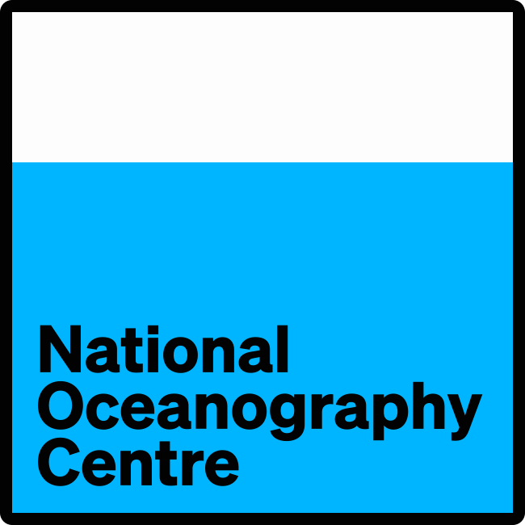
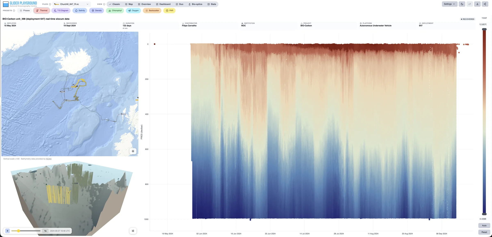
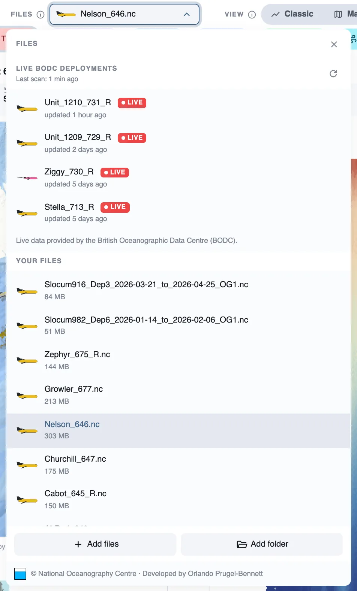
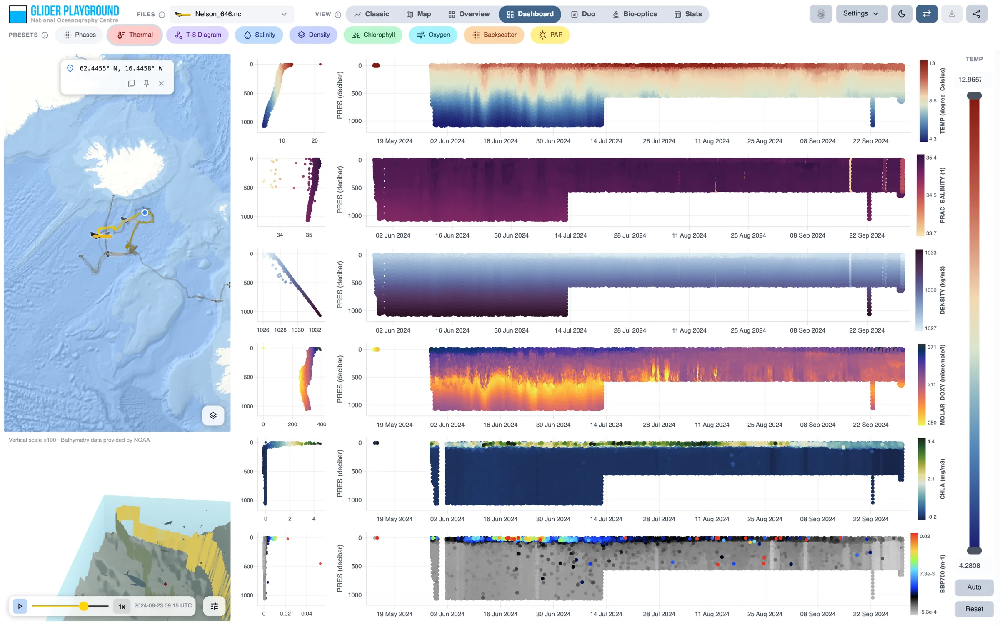
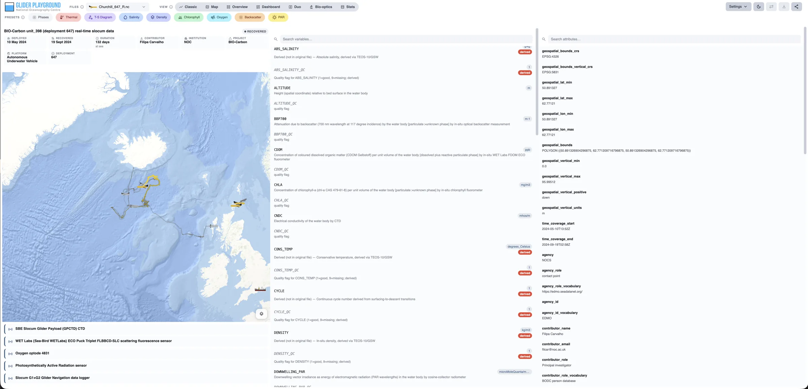
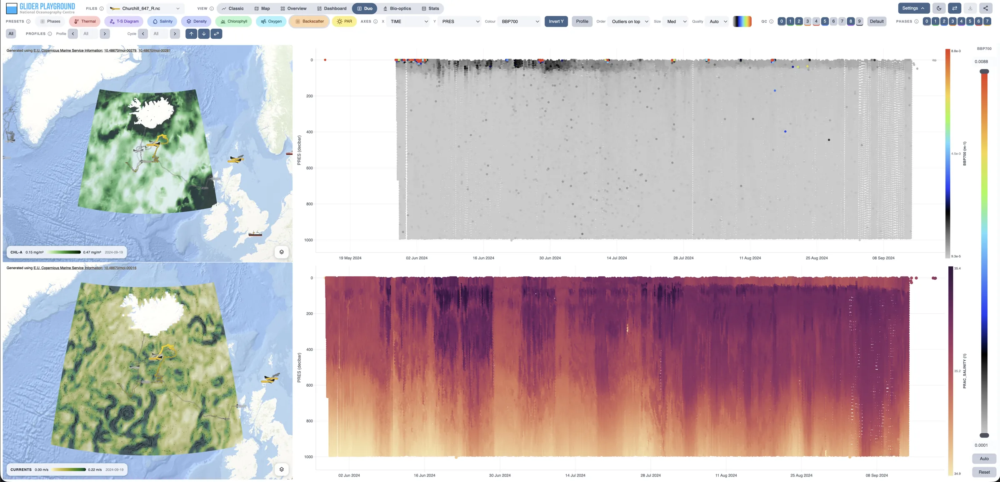
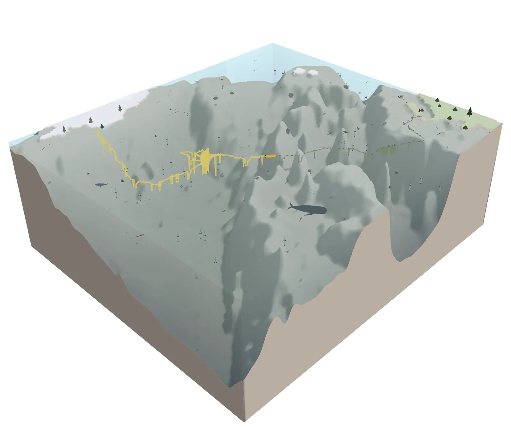
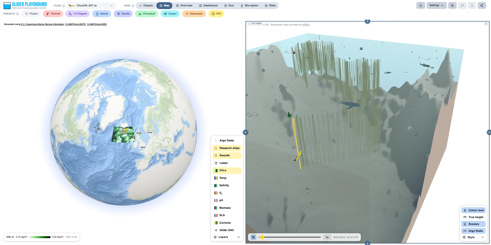
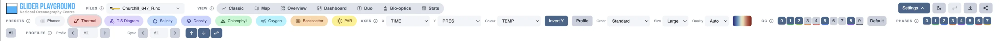
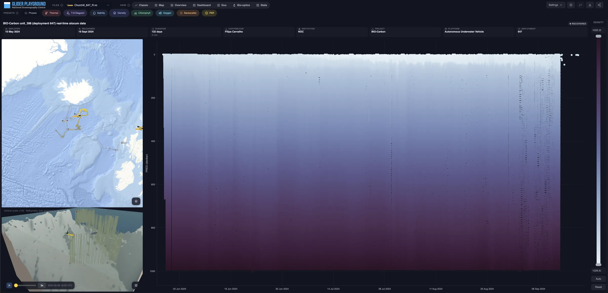

# Glider Playground

<a href="https://www.noc.ac.uk/" title="National Oceanography Centre"></a>

A fast, web-based explorer for ocean glider data. Load OG1 NetCDF files — or pull live deployments straight from BODC — and instantly plot, inspect, QC, and view them in 3D, all in your browser with no scripting required.

**Live demo:** [glider-playground.co.uk](https://glider-playground.co.uk) *(running on a Raspberry Pi — may be slow)*



---

## Install & Run

```bash
pip install glider-playground
glider-playground
```

This opens the app in your browser. Press `Ctrl+C` in the terminal to stop it.

> **Virtual environment recommended.** If you use one, activate it before running.

<details>
<summary>Install from source</summary>

```bash
git clone https://github.com/Orlando-PB/glider-playground.git
cd glider-playground
pip install .
```
</details>

---

## Loading Data



Click the **file button** (top-left) to open the file panel. You can:

- **Browse live BODC deployments** — pull published datasets directly from the British Oceanographic Data Centre
- **Add files** — pick individual `.nc` files
- **Add folder** — load an entire folder of `.nc` files at once

Your own files are processed once in the background. Once ready, click a file to load it.

> **File format:** input files must be in [OG1](https://github.com/OceanGlidersCommunity/OG-format-user-manual) format (or OG1-compatible) — the OceanGliders community NetCDF standard.

> Live data is provided by the [British Oceanographic Data Centre (BODC)](https://platforms.bodc.ac.uk/deployment-catalogue/).

---

## Views & Layout

Glider Playground is a flexible, multi-panel workspace — plots, the globe, and the 3D track are all panels you can arrange however you like.

- **Drag** a panel by its header to reorder or swap it with another
- **Split** any panel (the edge **+** buttons) to add another plot or map beside it
- **Resize** by dragging the dividers; **close** a panel with its ✕
- On a **vertical / mobile screen** the built-in views automatically re-flow so plots sit on top and the maps share a row beneath

### Views

The **View** bar rebuilds the whole workspace in one click:

| View | What you get |
|---|---|
| **Classic** | A single plot with the globe and 3D track (the default) |
| **Map** | Globe + 3D view side by side, no plot |
| **Overview** | Globe + 3D alongside the headline plots |
| **Dashboard** | Globe + 3D + the six core plots, each with a depth-profile sidebar |
| **Duo** | Two globes (chlorophyll + currents overlays) beside backscatter and salinity plots |
| **Bio-optics** | Temperature, chlorophyll, backscatter and PAR plots with a full-height globe |
| **Stats** | Deployment summary, map, instruments, and searchable variable / attribute tables (derived variables are labelled) |





### Presets

The **Presets** row sets what a plot shows: **Phases, Thermal, T-S Diagram, Salinity, Density, Chlorophyll, Oxygen, Backscatter, PAR**. Each picks sensible X/Y/Colour variables and a matching palette; presets the current file has no data for are greyed out.

### Globe & Overlays

- **Globe** — the glider's GPS track on an interactive 3D globe, with every other loaded deployment shown faintly alongside
- **Copernicus overlays** — drape satellite/model surface fields over the globe: **Chlorophyll-a, Temperature, Salinity, O₂, pH, Biomass, Sea Level Anomaly**. Layers are fetched in the background once per file, so a click is instant; buttons stay greyed out until their layer is ready. **Smooth** toggles interpolation of the overlay grid
- **Surface currents** — an animated particle-flow field of Copernicus surface currents
- **Glider DAC** — per-dive depth-averaged current vectors, shown when the file provides them
- **Argo floats** *(experimental)* — latest position of every Argo float, with details on click
- **Research ships** *(experimental)* — latest reported positions of RRS Discovery, RRS James Cook and RRS Sir David Attenborough



### 3D View

The dive track drawn in 3D over NOAA bathymetry (vertical scale ×100 by default).



- **Playback** — press play (or drag the slider) to fly the vehicle along its track, at a choice of speeds
- **Style** menu:
  - **Colour land** — shade land and ice above the waterline
  - **True height** — drop the ×100 vertical exaggeration
  - **Scenery** — depth-shaded seabed plus decorative, region-appropriate sea life (whales, fish, kelp, corals…). Purely cosmetic
  - **Argo floats** — show floats that surfaced near the glider during playback
- Gliders, autosubs (ALR) and other platforms get their own low-poly model

<br clear="right">



### Copernicus Setup

The surface overlays and currents are fetched live from [Copernicus Marine](https://marine.copernicus.eu/), which needs a (free) account and a one-time login:

1. **Register** for a free account at [marine.copernicus.eu/register](https://data.marine.copernicus.eu/register).
2. **Install** the toolbox:
   ```bash
   pip install copernicusmarine
   ```
3. **Log in** (stores your credentials locally), then restart Glider Playground:
   ```bash
   copernicusmarine login
   ```

Once you're logged in, the overlay layers fetch on demand. Until then the app will prompt you with whichever of these steps is missing.

### Citing Copernicus data

Overlays and currents are derived from Copernicus Marine products, so anything you publish from them should carry the credit line the [licence](https://marine.copernicus.eu/user-corner/service-commitments-and-licence) asks for (the map shows it whenever a layer is on):

> Generated using E.U. Copernicus Marine Service Information; DOI links below

| Layer | Product | DOI |
|---|---|---|
| Temperature, Salinity, Currents | Global Ocean Physics Analysis and Forecast | [10.48670/moi-00016](https://doi.org/10.48670/moi-00016) |
| O₂, pH, Biomass | Global Ocean Biogeochemistry Analysis and Forecast | [10.48670/moi-00015](https://doi.org/10.48670/moi-00015) |
| Chlorophyll-a | Global Ocean Colour L4 (NRT / Multi-Year) | [10.48670/moi-00279](https://doi.org/10.48670/moi-00279) / [10.48670/moi-00281](https://doi.org/10.48670/moi-00281) |
| Sea Level Anomaly (SLA) | Global Ocean Sea Level L4 (NRT / Multi-Year) | [10.48670/moi-00149](https://doi.org/10.48670/moi-00149) / [10.48670/moi-00148](https://doi.org/10.48670/moi-00148) |

For a paper, Copernicus recommends "*Product Title*. E.U. Copernicus Marine Service Information (CMEMS). Marine Data Store (MDS). DOI: 10.48670/moi-xxxxx (Accessed on DD MMM YYYY)".

---

## Plotting & Inspecting

By default, presets drive the plots. Open **Settings** (top bar) to take manual control — it reveals the **X**, **Y**, and **Colour** variable pickers, plus draw order, point size, quality, palette, QC, phases and profile controls.



- **Box zoom** — click and drag on the plot; double-click to reset
- **Axis sliders** — trim the X, Y, or colour range precisely (**Auto** / **Reset** beside the colour bar)
- **Inspector** — hover the plot to read exact values for the nearest sample in a floating card
- **Profile sidebar** — the **Profile** button adds a value-vs-depth plot to the left of a plot
- **Order / Size / Quality** — choose which points draw on top, marker size, and the maximum number of points drawn
- **Colour palette** — pick from a range of oceanographic colour maps
- **Phases** — show only selected glider phases
- **Sync time** — zooming one timeseries zooms every open plot
- **Share** — copy a link that reopens this exact view
- **Download** — save the current plot as a PNG
- **Dark theme** — toggle from the top bar



### Profiles

If a file contains dive profiles, a **Profiles** navigator appears. Step through individual profiles or cycles, filter by direction (upcast / downcast / transect), or view everything at once.

---

## Quality Control *(Settings)*

QC flags follow the Argo convention: `0` No QC, `1` Good, `2` Probably good, `3` Probably bad, `4` Bad, `5` Changed, `8` Interpolated, `9` Missing. Samples are always filtered to the allowed set (default `0,1,2,5,8`) — click a **QC** chip to show only that flag, click again to restore all.

There's no separate Filter Time / Interpolate / Clean toggle — that processing always runs, and the QC chips are the only control:

- PRES gaps up to 5 minutes are always interpolated (flag `8`); a longer gap is a real data gap and is left unfilled.
- Exact `0.0` fill values in PRES/TEMP/CNDC are always flagged missing (flag `9`) and nulled.
- NaT and out-of-order timestamps are always dropped outright (not flag-gated — they aren't meaningful data). Other out-of-range timestamps (pre-1990 / future) are flagged bad (flag `4`) and filterable like anything else.

---

## Jelly — Notifications

**Jelly** is a passive notification icon in the top bar, next to Settings. It stays hidden until there's something worth showing — a new release, or Copernicus overlay setup help — then reveals itself with a dot and lists the notes.

---

## Uninstall

```bash
pip uninstall glider-playground
```

---

## Developer Docs

To change the default plots, dashboard views or colour palettes, edit [`glider_playground/plot_presets.json`](glider_playground/plot_presets.json) (instructions are at the top of the file) and restart.

See [OVERVIEW.md](OVERVIEW.md) for the code layout, architecture, data pipeline, and deployment.

---

## License

Licensed under the [Apache License 2.0](LICENSE).

<a href="https://www.noc.ac.uk/" title="National Oceanography Centre"></a>

Developed by **Orlando Prugel-Bennett** at the **[National Oceanography Centre (NOC)](https://www.noc.ac.uk/)**.

© 2026 National Oceanography Centre.
