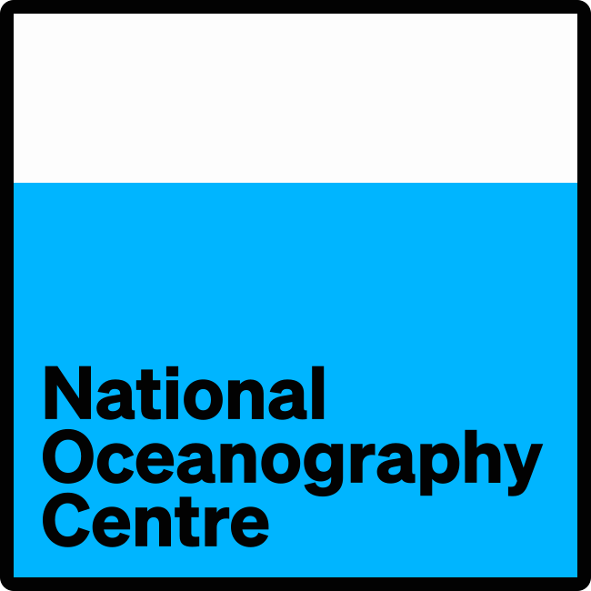
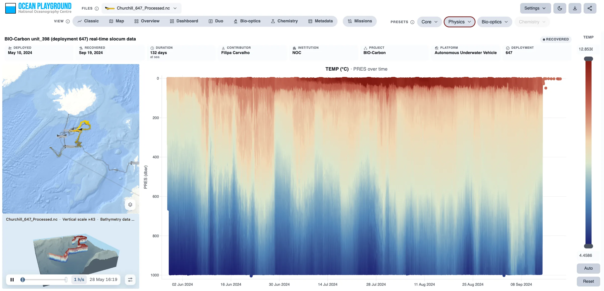
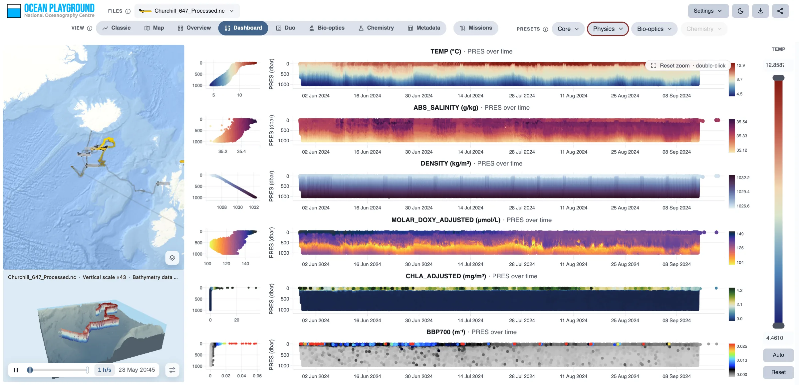
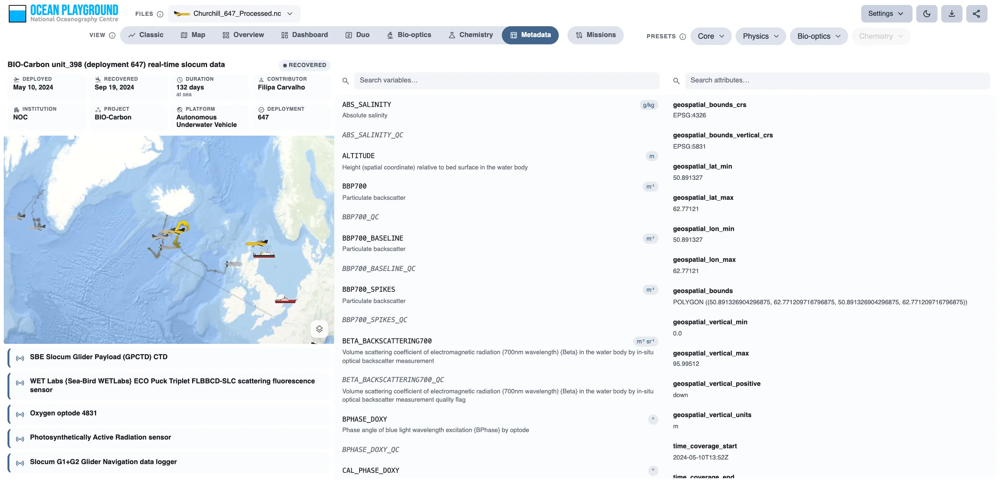
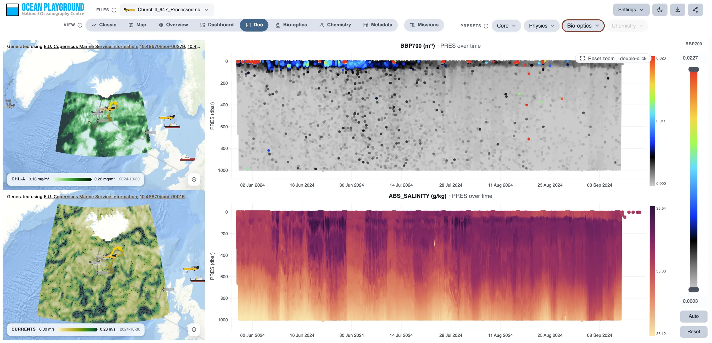
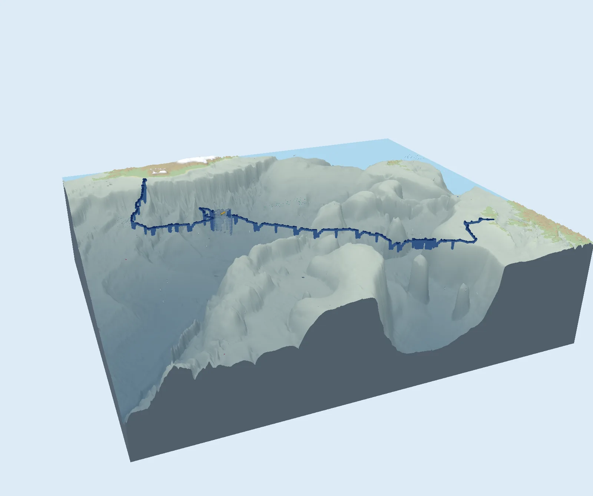
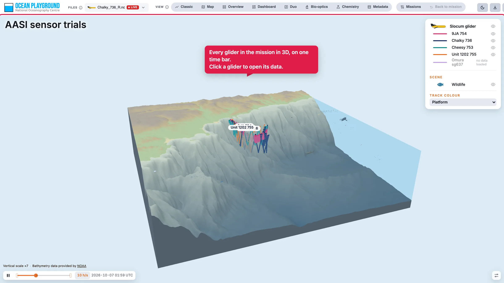

# Ocean Playground

<a href="https://www.noc.ac.uk/" title="National Oceanography Centre"></a>

A web-based viewer for ocean glider and other platform data. Load your own OG1 NetCDF files, or open live deployments from BODC.

> **Renamed:** Glider Playground is now **Ocean Playground**. So far only the name has changed: the PyPI package, the
> `glider-playground` command, the `~/.glider_playground` folder and the website (glider-playground.co.uk) still use
> the old name and will be moved over time.

**Live site:** [glider-playground.co.uk](https://glider-playground.co.uk), no login needed *(it runs on a Raspberry Pi, so it can be slow)*

**One-page guides (A5 PDF):** [Cheat sheet](https://github.com/Orlando-PB/glider-playground/blob/main/docs/cheat_sheet.pdf), how to use it · [Features](https://github.com/Orlando-PB/glider-playground/blob/main/docs/features.pdf), what it does



---

## Install & Run

```bash
pip install glider-playground
glider-playground
```

This opens the app in your browser. Press `Ctrl+C` in the terminal to stop it.

<details>
<summary>Install from source</summary>

```bash
git clone https://github.com/Orlando-PB/glider-playground.git
cd glider-playground
pip install .
```
</details>

---

## Loading Data

Click the file name (top left) to open the file panel. From there you can:

- **Open a live BODC deployment**: platforms reporting in the last week are listed at the top
- **Add files**: pick individual `.nc` files
- **Add folder**: load every `.nc` file in a folder

Each file is processed once in the background; click it when it's ready.

> **File format:** files must be [OG1](https://github.com/OceanGlidersCommunity/OG-format-user-manual) (or OG1-compatible), the OceanGliders community NetCDF format.

> Live data is provided by the [British Oceanographic Data Centre (BODC)](https://platforms.bodc.ac.uk/deployment-catalogue/).

---

## Views & Layout

Plots, the globe and the 3D view are panels. Drag a panel by its header to move it, use the **+** on its edges to add another panel beside it, drag the dividers to resize, and close a panel with its ✕.

### Views

The **View** bar sets up the whole layout:

| View | Shows |
|---|---|
| **Classic** | One plot, with the globe and 3D view (the default) |
| **Map** | Globe and 3D view side by side |
| **Overview** | Globe and 3D view next to the main plots |
| **Dashboard** | Globe, 3D view and six plots, each with a depth-profile sidebar |
| **Duo** | Two globes (chlorophyll and currents) next to backscatter and salinity plots |
| **Bio-optics** | Temperature, chlorophyll, backscatter and PAR, with a full-height globe |
| **Chemistry** | Nitrate, pH, DIC and redox, with a full-height globe (greyed out if the file has no chemistry sensors) |
| **Metadata** | Deployment summary, map, instruments, and searchable variable and attribute lists (click a variable to plot it; derived variables are labelled) |





### Presets

**Presets** pick what a plot shows. They are grouped into four menus:

| Group | Presets |
|---|---|
| **Core** | Phases, Dive, PRES vs PRES2, PRES & PRES2, Sensor temps |
| **Physics** | Thermal, T-S Diagram, Salinity, Density (each also as a "2" version for a second CTD, e.g. a SixSense sensor) |
| **Bio-optics** | Chlorophyll, Oxygen, Backscatter, PAR |
| **Chemistry** | Nitrate, Phosphate, Alkalinity, pH, DIC, Redox |

Presets the file has no data for are greyed out.

### Globe & Overlays

- **Globe**: the glider's GPS track, with every other loaded deployment shown faintly
- **Copernicus overlays**: surface fields from satellites and models: chlorophyll-a, temperature, salinity, O₂, pH, biomass and sea level anomaly, plus currents as moving particles. **Smooth** interpolates the grid, and **Latest** shows today's conditions instead of the deployment date
- **Glider DAC**: depth-averaged current for each dive, when the file has it
- **Argo floats**: the last position of every Argo float; click one for its details and drift track
- **Research ships**: latest positions of RRS Discovery, RRS James Cook and RRS Sir David Attenborough



### 3D View

The dive track in 3D over NOAA bathymetry. Depth is stretched so the dives are visible.



- **Playback**: press play, or drag the slider, to move the vehicle along its track
- **Style** menu:
  - **Home**: back to the starting view
  - **Follow**: keep the camera on the vehicle
  - **True height**: turn off the depth stretch
  - **Argo**: floats that surfaced near the glider, with their dives
  - **Dive lines**: show or hide the Argo floats' dives
  - **Wildlife**: the odd animal swimming past (just for fun)
  - **Track colour**: colour the track by a preset, or by whatever the selected plot shows

<br clear="right">

### Missions

**Missions** (top bar) puts several platforms in one 3D scene on a shared time bar: gliders, ALRs, Argo floats and ships. Live BODC gliders working near each other are grouped into a mission automatically. You can also write your own as a JSON file (see [missions/README.md](glider_playground/missions/README.md)). Click a platform to open its data.



### Copernicus Setup

The overlays and currents come from [Copernicus Marine](https://marine.copernicus.eu/), which needs a free account and a one-time login:

1. **Register** at [marine.copernicus.eu/register](https://data.marine.copernicus.eu/register).
2. **Install** the toolbox:
   ```bash
   pip install copernicusmarine
   ```
3. **Log in** (this saves your credentials locally), then restart Ocean Playground:
   ```bash
   copernicusmarine login
   ```

Until you're logged in, the app tells you which of these steps is missing.

Overlays and currents are provided by the E.U. Copernicus Marine Service:

- Global Ocean Physics Analysis and Forecast. E.U. Copernicus Marine Service Information (CMEMS). Marine Data Store (MDS). DOI: [10.48670/moi-00016](https://doi.org/10.48670/moi-00016)
- Global Ocean Biogeochemistry Analysis and Forecast. CMEMS, MDS. DOI: [10.48670/moi-00015](https://doi.org/10.48670/moi-00015)
- Global Ocean Colour L4 (NRT / Multi-Year). CMEMS, MDS. DOI: [10.48670/moi-00279](https://doi.org/10.48670/moi-00279), [10.48670/moi-00281](https://doi.org/10.48670/moi-00281)
- Global Ocean Sea Level L4 (NRT / Multi-Year). CMEMS, MDS. DOI: [10.48670/moi-00149](https://doi.org/10.48670/moi-00149), [10.48670/moi-00148](https://doi.org/10.48670/moi-00148)

---

## Plotting & Inspecting

Presets set up the plots. Open **Settings** (top bar) to choose any variable for the x axis, y axis and colour, and for the options below.

- **Zoom**: drag a box on the plot; double-click to reset
- **Colour range**: drag the ends of the colour bar (**Auto** / **Reset** beneath it)
- **Inspector**: hover the plot to read the nearest sample's values
- **Profile**: adds a value-against-depth plot to the left of a plot
- **Order / Size / Quality**: which points draw on top, marker size, and how many points are drawn (up to every point)
- **Colour palette**: a choice of oceanographic colour maps
- **Phases**: show only some glider phases
- **Sync time**: zooming one plot zooms them all
- **Share**: copy a link that reopens this exact view
- **Download**: save a PNG of the whole workspace, without the controls
- **Dark theme**: the moon button in the top bar

### Profiles

If a file has dive profiles, a **Profiles** navigator appears. Step through single profiles or cycles, filter by direction (up, down or transect), or show everything.

---

## Quality Control

QC flags follow the Argo convention: `0` No QC, `1` Good, `2` Probably good, `3` Probably bad, `4` Bad, `5` Changed, `8` Interpolated, `9` Missing. Only samples with an allowed flag are shown (default `0,1,2,5,8`).

- PRES gaps of up to 5 minutes are always interpolated (flag `8`); longer gaps are real gaps and are left empty.
- Exact `0.0` fill values in PRES/TEMP/CNDC are always flagged missing (flag `9`) and removed.
- NaT and out-of-order timestamps are always dropped. Other out-of-range times (before 1990 or in the future) are flagged bad (flag `4`) and can be filtered like any other flag.

---

## Uninstall

```bash
pip uninstall glider-playground
```

---

## Developer Info

To change the default plots, views or colour palettes, edit [`glider_playground/plot_presets.json`](glider_playground/plot_presets.json) (instructions at the top of the file) and restart.

See [OVERVIEW.md](OVERVIEW.md) for the code layout, architecture, data pipeline and deployment.

---

## License

Licensed under the [Apache License 2.0](LICENSE).

<a href="https://www.noc.ac.uk/" title="National Oceanography Centre"></a>

Developed by **Orlando Prugel-Bennett** at the **[National Oceanography Centre (NOC)](https://www.noc.ac.uk/)**.

© 2026 National Oceanography Centre.
